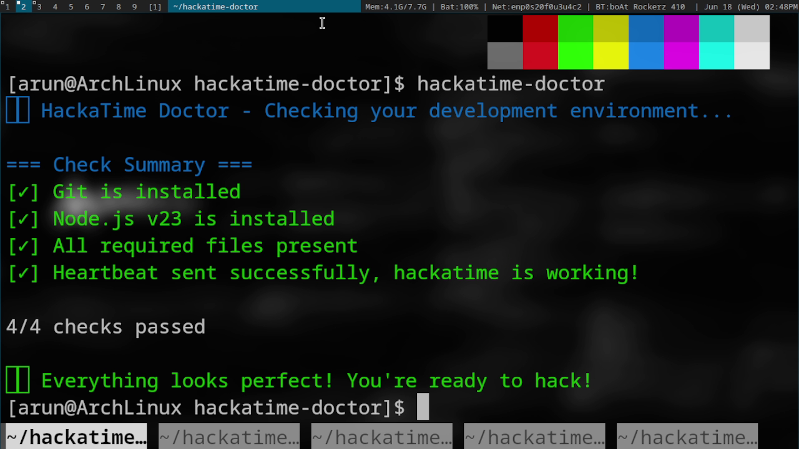

# HackaTime Doctor ⚕️ 



A diagnostic tool that verifies your development environment meets all requirements for Hack Club's HackaTime.

## Features

- ✅ Checks for required software (Git, Node.js)
- 🔍 Validates project structure
- 🔑 Tests API connectivity
- 📊 Generates JSON/CSV reports
- 🖥️ Cross-platform support (Linux/macOS/Windows)

## Installation

### Quick Install (Recommended)

Download the latest release for your platform:

**[📥 Download Latest Release](https://github.com/arungeorgesaji/hackatime-doctor/releases/latest)**

#### Windows
1. Download the Windows release (`.zip` file)
2. Extract the zip file to your desired location
3. Open PowerShell in the extracted folder
4. Choco (Chocolatey) is required for the installation. If you don't have it installed, follow these steps:

   1. Open PowerShell as Administrator
   2. Run the following command to install Chocolatey:

      ```powershell
      iex ((New-Object System.Net.WebClient).DownloadString('https://chocolatey.org/install.ps1'))
      ```

5. Install OpenSSL if not already installed (required for HTTPS requests), follow these steps:

    1. Open PowerShell as Administrator
    2. Run the following command to install OpenSSL:

       ```powershell
       choco install openssl
       ```
6. Set console encoding to UTF-8 (recommended for proper output display in powershell):

   ```powershell
   # Temporary (for current session only):
   [Console]::OutputEncoding = [System.Text.Encoding]::UTF8

   # Permanent (add to PowerShell profile):
   Add-Content -Path $PROFILE -Value "[Console]::OutputEncoding = [System.Text.Encoding]::UTF8"
   ```

6. Run the executable directly from the extracted folder, or for global access, copy hackatime-doctor.exe to a directory in your system PATH (like C:\Program Files\HackaTime Doctor) 

#### Linux/macOS
1. Download the appropriate release for your platform in your desired location
2. Extract the archive:

   ```bash
   tar -xzf hackatime-doctor-*.tar.gz
   ```
3. Run the installation script:

   ```bash
   chmod +x install.sh
   sudo ./install.sh
   ```

### Build from Source

If you prefer to compile from source:

```bash
git clone https://github.com/arungeorgesaji/hackatime-doctor.git
cd hackatime-doctor
make
sudo make install
```

## Usage

After installation, run the diagnostic tool:

```bash
hackatime-doctor
```

## Output Formats

Generate reports in multiple formats:

```bash
# Output to terminal 
hackatime-doctor

# JSON report
hackatime-doctor --json

# CSV report  
hackatime-doctor --csv
```
